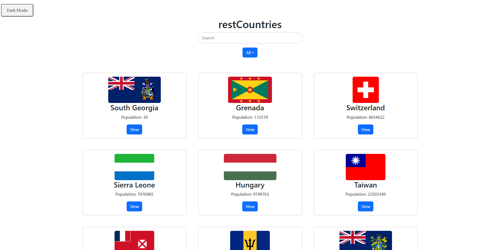

# RestCountries 



This React app allows users to learn new information about countries across the globe, powered by data recieved from the RestCountries, OpenWeatherMap and ExchangeRate API's.

Currently hosted at https://rest-countries-jh.web.app/ using Firebase.

## Features

1. **Country Search**: Search for countries by name.
2. **Country Details**: View in-depth information about each country.
3. **Weather Information**: Check the current weather in the capital city of each country.
4. **Currency Converter**: Convert between the country's currency against other major currencies.

## Installation

1. Clone the repository:

   ```bash
   git clone https://github.com/Jack-Heffernan/rest-countries.git

2. Change directory into the project folder:
   
   ```bash
   cd rest-countries

3. Install dependencies:

   ```bash
   npm install

## API Setup

To enable the weather and exchange rate features, you will need to set up API keys for:

1. OpenWeather API
2. ExchangeRate-API

## Technologies Used

React: Frontend framework for building user interfaces.
Axios: For making API requests to RestCountries, OpenWeather, and ExchangeRate-API.
Bootstrap: For layout and styling.
